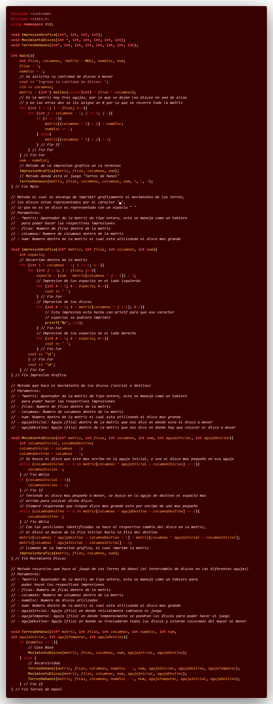
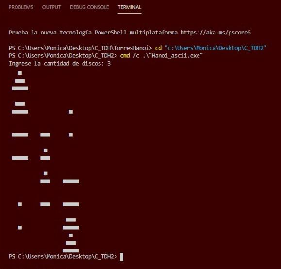

# C++_TDH2

## :copyright: Autor

- :camera:  
- :woman: **Mónica Valeria Castillo**
- :e-mail: monicastillo@unitec.edu
- :link: [github.com/monicastle](https://github.com/monicastle)
- :calendar: 15/09/2020

---

## :dart: Objetivos

Proyecto Torres de Hanoi (Parte 2) en **C++** diseñado para demostrar:

1. :books: Poner en practica un ejercicio clasico de programación que nos ayudará en:
   - **La Recursividad**
   - **Despliegue gráfico de la salida**
3. :open_file_folder:La organización de:
   - Código (**Visual Studio Code** y Repositorio en **Github**)
   - Imágenes (Extensión **Polacode** de **VSC**)
   - Formato (**Markdown** en **VSC**)

---

## :red_circle: Hanoi_ascii.cpp

## :purple_circle: Salida - Torres de Hanoi Graficamente

El proyecto consiste en un famoso y clasico juego llamado Las Torres de Hanoi. Se tienen tres agujas y una cantidad de discos, se debe poder pasar los discos a las otras dos agujas cumpliendo que un disco pequeño este siempre arriba de uno mas grande. La impresion es el traspaso de los discos en las diferentes agujas mostrado de forma grafica, para ello se ocuparon tres metodos. El primero es llamado "ImpresionGrafica", este consiste en imprimir los discos en los respectivos lugares dentro de una matriz que funciona como un tablero. Los discos se distinguen por un caracter especial de la tabla ascii, el cual es un cuadrado relleno (lo que no es un disco es representado con un espacio). El segundo metodo se llama "MovimientoDiscos", este consiste en el movimiento de los discos de una fila inicial hacia una fila de destino. Se obtiene la posicion en la matriz donde hay un disco pequeño para mover, luego se busca un espacio libre donde dejar dicho disco (cumpliendo que no sea muestro sobre un disco mas pequeño). El ultimo metodo es llamado "TorresDeHanoi", este es un metodo recursivo que desarrolla el juego, es decir el cambio de los discos de forma que se logre el objetivo. En el main se pide la cantidad de discos con los que se jugará y se hace un recorrido en la matriz, en una aguja se asignan los discos y en las otras dos se les asigna un 0 de manera que se puede identificar en donde estan los discos. Se hace el llamado de los metodos: "ImpresionGrafica" y "MovimientoDiscos", todo esto dando como resultado la salida mostrada en la imagen adjunta.

---

## :computer: Código

- :blue_book: [C_TDH2](https://github.com/monicastle/C_TDH2)

---
## :wrench: Herramientas
- :package: [Visual Studio Code](https://code.visualstudio.com/)
- :camera: [Polacode-2020 v0.5.2](https://github.com/jeff-hykin/polacode)
- :notebook: [Markdown Cheatsheet](https://github.com/adam-p/markdown-here/wiki/Markdown-Cheatsheet)
- :smile: [Emoji Cheat Sheet](https://www.webfx.com/tools/emoji-cheat-sheet/)
